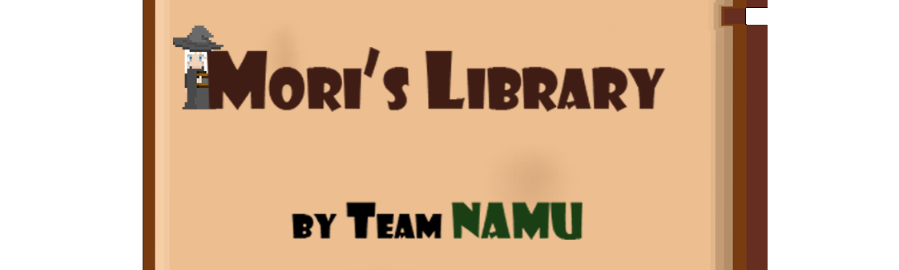

## Welcome to Mori's Library
**You embark on an adventure in Mori's Library, a place filled with magical books. Defeat the bosses within each book and find the path to the lower floors if you can.**

---

### Simple control
**Move character using ARROW key** 
**Dash and Attack using Z key** 
**Parrying enemy's attack using X key**

---

## Enter this library and encounter many formidable BOSSES!

---

## Develope
**I made this game with 3 friends using Visual studio, VS Code, Asprite and so on. (You can see any program in the credit scence)**  
**I usually made a our local game engine(graphic pipeline, engine flow...) using C++ and game contents(bosses, map design, tutorial...)**
